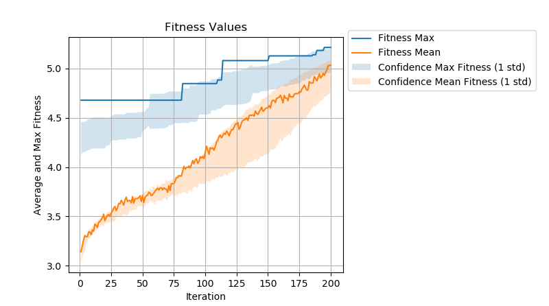

[](http://quantlet.de/)

## [](http://quantlet.de/) **SL_2020_Genetic_Algorithm_UAV** [](http://quantlet.de/)

```yaml

Name of Quantlet: SL_2020_Genetic_Algorithm_UAV

Published in: SL_Klagenfurt_2020

Description: "Scheduling algorithm for UAV teams based on a genetic algorithm."

Keywords: 'Scheduling, UAV, Genetic, Tasks, Chromosomes'

Author: Eren Allak

Submitted:  Tue, April 21 2020 by Eren Allak

```



### PYTHON Code
```python

#!/usr/bin/env python2
"""

@author: Eren Allak

"""

#
# Packages.
#

# Import packages.
from genetic_algorithm import GeneticAlgorithm
from task import Task


#
# Parameters and constants.
#

class GeneticAlgorithmParameters:
    def __init__(self):
        # General Parameters.
        self.RAND_SEED = 1

        # Planning parameters.
        self.N_TIME_SLOTS_CYCLE = 12  # The scheduling cycle is split into equal time slots.
        self.N_TIME_SLOTS_TASK = self.N_TIME_SLOTS_CYCLE / 2  # Maximal number of task time slots.
        self.N_TASKS = 5  # Number of tasks.
        self.N_TEAMS = 10  # Number of teams to carry out tasks.

        # Parameters for genetic algorithm.
        # Genetic representation of scheduling by a double array.
        # Arrays correspond to time slots for the start of the task and corresponding team id.
        self.N_CHROMOSOME_LENGTH = self.N_TIME_SLOTS_TASK * self.N_TASKS
        self.N_CHROMOSOMES = 100

        # Constants.
        self.EMTPY_TEAM_ID = -1

        # Genetic algorithm parameters.
        self.N_ITERATIONS = 200
        self.N_CROSSOVER = int(round(self.N_CHROMOSOMES / 4))
        self.N_MUTATE = int(round(self.N_CROSSOVER / 4))

        # Randomized Simulation.
        self.N_RANDOMIZED_SIM = 10


# Main function.
def main():
    # Define Tasks. Input:
    # - execution duration for a team in time slots
    # - ideal number of time slots until next execution
    # - ideal number of executions in whole planning cycle
    task_a1 = Task("A1 Standard Border Check Side 1", 3, 2, 6)
    task_a2 = Task("A2 Standard Border Check Side 2", 3, 2, 6)
    task_b1 = Task("B1 High Altitude Movement Check Side 1", 3, 4, 3)
    task_b2 = Task("B2 High Altitude Movement Check Side 2", 3, 4, 3)
    task_c1 = Task("C1 Long Term Cartography", 3, 6, 2)

    tasks = [task_a1, task_a2, task_b1, task_b2, task_c1]

    param = GeneticAlgorithmParameters()
    ga = GeneticAlgorithm(param, tasks)
    ga.start()
    ga.plot_results()

    # Show fitness values and best schedule.
    # print("Best schedules:")
    # for i in range(1, 6):
    #     print("Fitness: {0}".format(ga.fitness_values[-i]))
    #     ga.print_schedule([ga.chromosomes[0][-i], ga.chromosomes[1][-i]])
    #     print ("")

    # print("Worst schedules:")
    # for i in range(0, 5):
    #     print("Fitness: {0}".format(ga.fitness_values[i]))
    #     ga.print_schedule([ga.chromosomes[0][i], ga.chromosomes[1][i]])
    #     print ("")

    print("Best solution:")
    ga.print_team_time_slots(-1)


if __name__ == "__main__":
    main()

```

automatically created on 2020-04-21